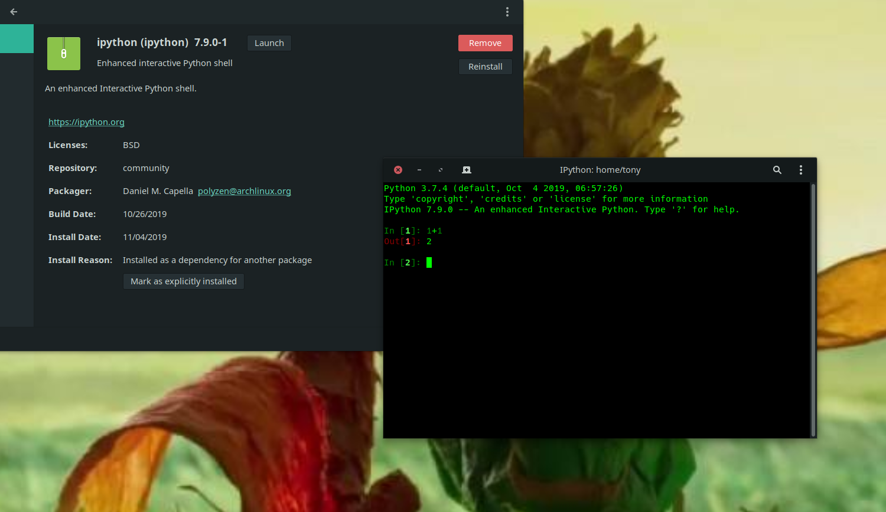

# Welcome to Head First Learn to Code
You'll find all the source code from the book Head First Learn to Code here.<br>
原书是基于MacOS环境,但本仓库是在Linux环境下进行,总所周知,当前乔布斯抄袭BSD创建的MacOS,所以Linux与MacOS的本源相同。<br>
The original book is based on the macOS environment, this warehouse is in the Linux environment, the same principle.


### 一、Install Python3
#### 1、Arch linux
```
$> sudo pacman -S python3
```
具体代码可能还需要安装其他依赖库,具体看该代码的```README```文档

#### 2、CentOS7
```
$> wget https://www.python.org/ftp/python/3.7.0/Python-3.7.0.tgz
$> tar -zxvf Python-3.7.0.tgz
$> ./configure && make&&make install
```
#### 关于平台的建议选择
Python3虽然已经可以完美支持Windows10，但是对于微软之前对开源的态度所以一些早期开源项目对微软支持差。但是随着时间的流失，西边的太阳就要落山了，微软也开始认真的对待开源项目,但谁知道微软那天又换一个CEO对开源有开始充满敌意了呢?<br>
考虑这些不稳定的因素,所以这里开发平台(Linux)以及开发工具(python)都是开源的

### 二、开发工具
#### 1、[Vim](https://vim.sourceforge.io/)
对于linux用户来说使用 VIM 是必备技能,当然你使用[Emacs](https://www.gnu.org/software/emacs/)也可以

#### 2、Ipython
```
$> pacman -S ipython
```

实际上,我的代码截图后面使用的是VS Code,一直都没有使用IDE工具

### 三、下载源码
[官方网址](https://www.wickedlysmart.com/hflearntocode/)

如果你想下载本书源代码
```
$> wget https://github.com/erictfree/headfirstlearntocode/archive/master.zip
```
### 四、购买书籍
[亚马逊 Amazon](https://www.amazon.com/Head-First-Learn-Code-Computational/dp/1491958863) 
[京东](https://search.jd.com/Search?keyword=Head%20First%E7%BC%96%E7%A8%8B%E4%B9%8B%E6%97%85&enc=utf-8&wq=Head%20First%E7%BC%96%E7%A8%8B%E4%B9%8B%E6%97%85&pvid=b150cf51f5ad449e9467aa8cfedf87f3)
[当当网](http://search.dangdang.com/?key=Head%20First%B1%E0%B3%CC%D6%AE%C2%C3&act=input)
