### 伪代码
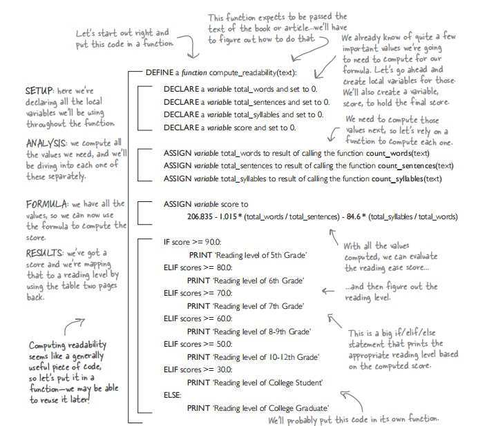

#### Step1检查是否可以正常输出 p253
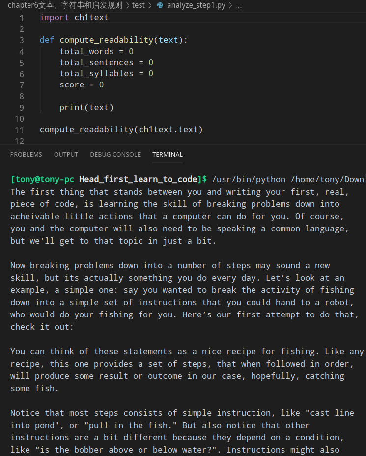

#### Step2分割字符串 split()
使用split()函数<br>
python内置的函数,他可以吧一个字符串分解成子串,(根据的是空格,制表符,换行符),最后吧各子串放在列表中
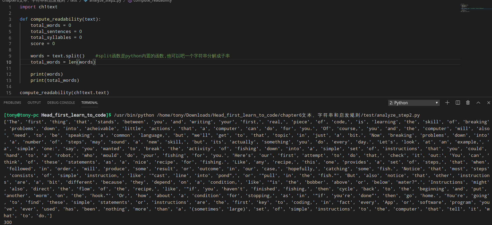

#### Step3 计算符号
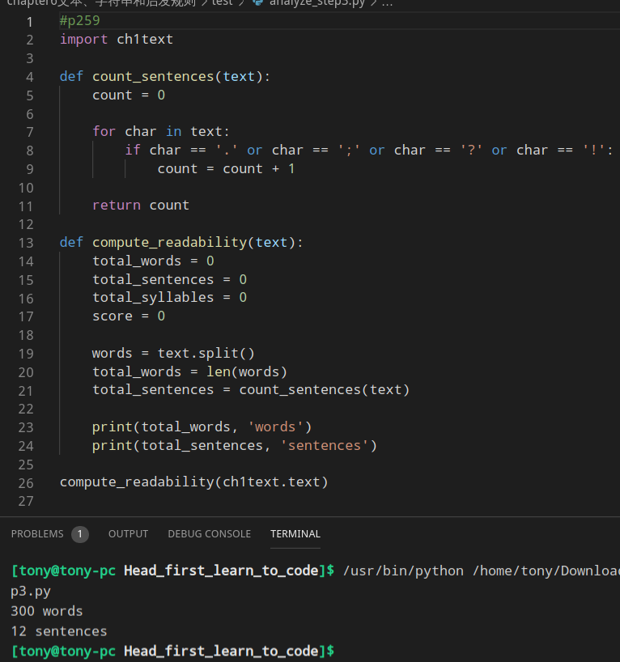

#### Step4 变简洁
使用 <b>in</b> 操作符可以测试字符串中是否含有某字符
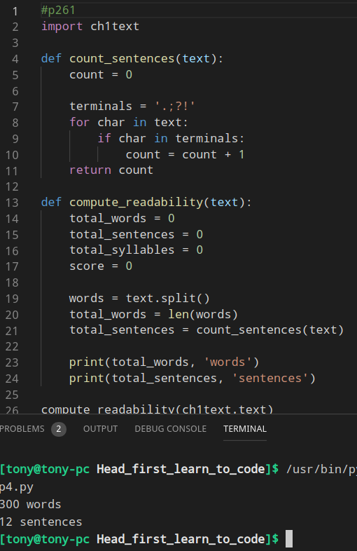

#### Step5 建立启发规则
> 1.如果一个单词少于3个字符,就计为一个音节
> 2.统计元音的个数,并一次代表音节的个数
> 3.为了是上一步更精确,删除单词中连续的元音
> 4.考虑不发音的e,删除单词末尾的e
> 5.如果y是最后一个音符,就把他当做一个音节

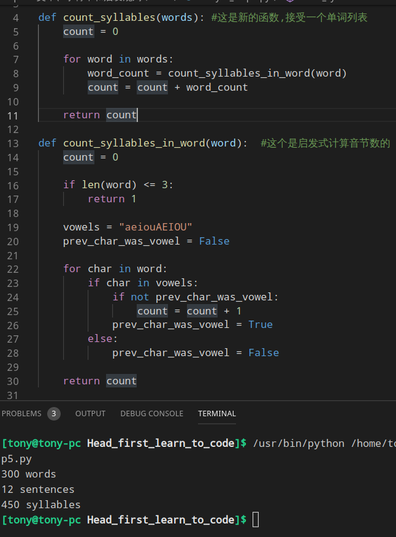

#### Step6 对字符串进行分片
step6完成Step5中前4点
```python
my_substring = lyrics[2:7] #表示从第2个开始(含第2个)到第7个(不含第7个)
str = 'a man a plan panama'
str[3:-1] -> 'an a plan panam'
str[-2:-1] -> 'm'
```
分片操作不仅可以使用在字符串上,还可以使用在列表上
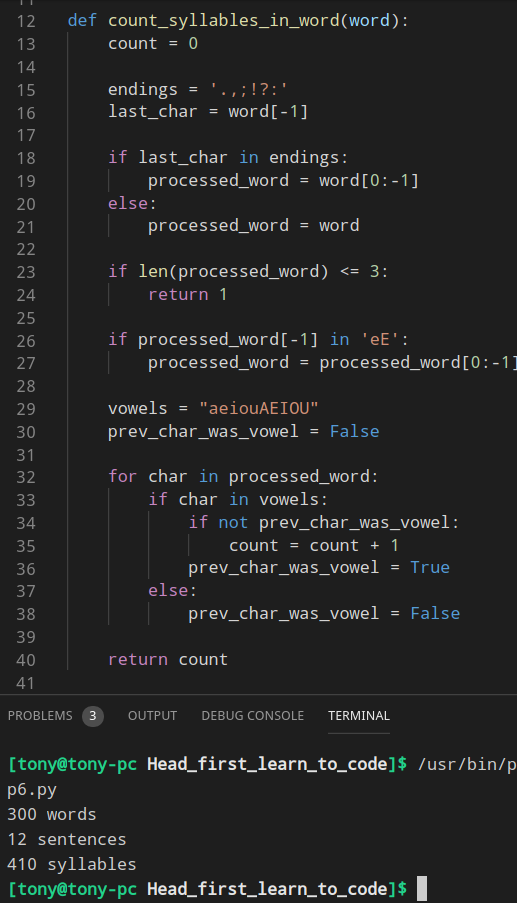

#### Step7 对字符串进行分片
step6完成Step5中前5点
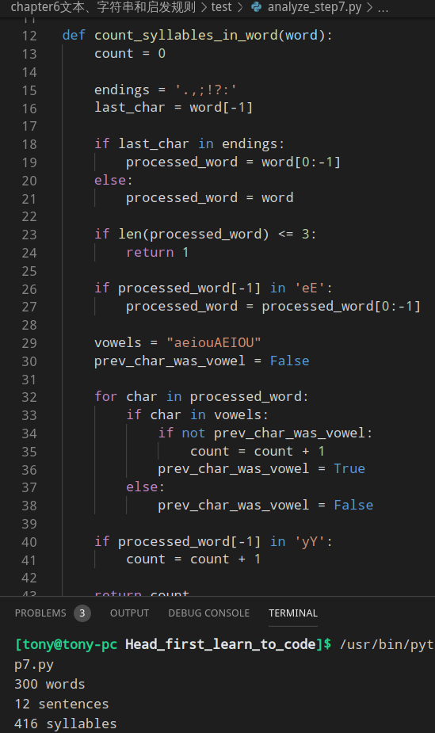

#### Step8 实现阅读难易度公式
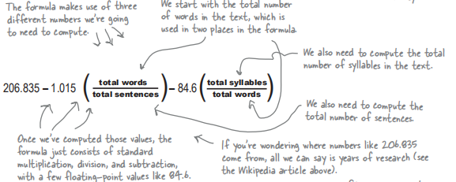
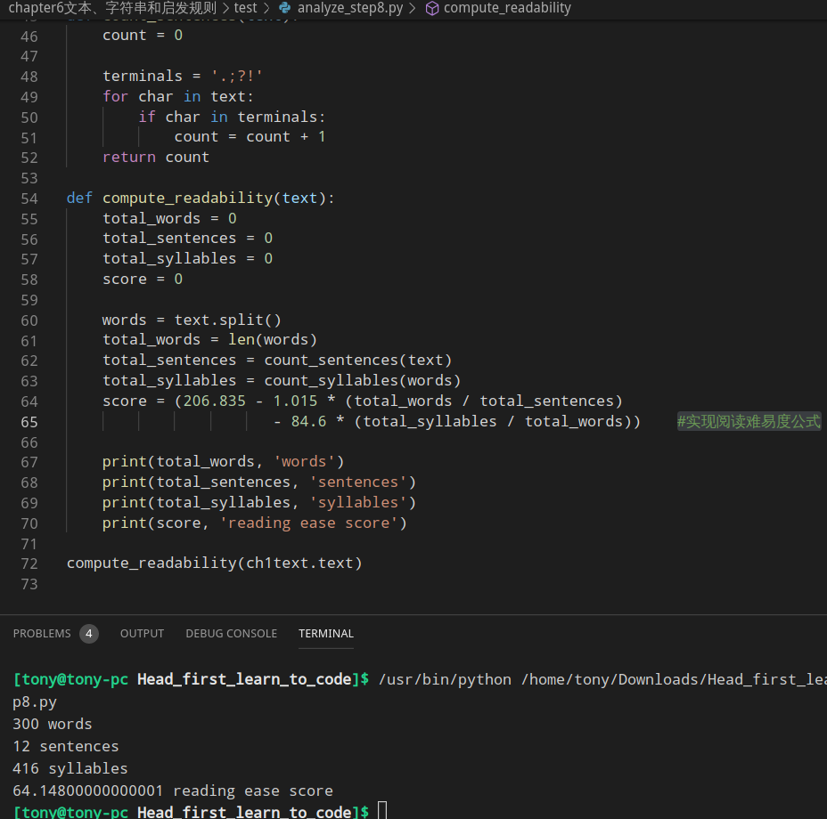

#### Step9 直接输出阅读等级
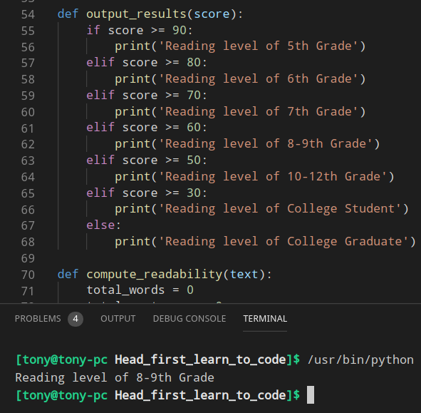

#### 最终成品
[analyze.py](analyze.py)