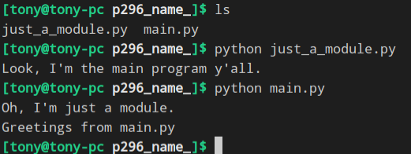

### Dunder name
只要执行一个Python文件,在后台Python解释器就会创建一个全局变量 \_name_ <br>
创建之后Python需要为他赋值,一般赋值有两种情况
> \_main_:这个文件作为主程序
> \_XXX_:这个XXX是模块的名字
```python
# just_a_module.py
if __name__ == '__main__':
    print("Look, I'm the main program y'all.")
else:
    print("Oh, I'm just a module.")
```

```python
#main.py
import just_a_module
    
print('Greetings from main.py')
```
