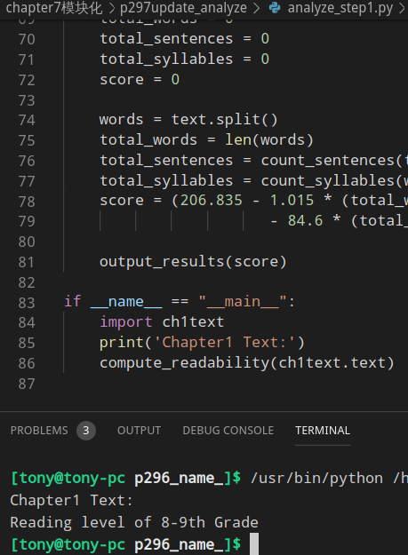
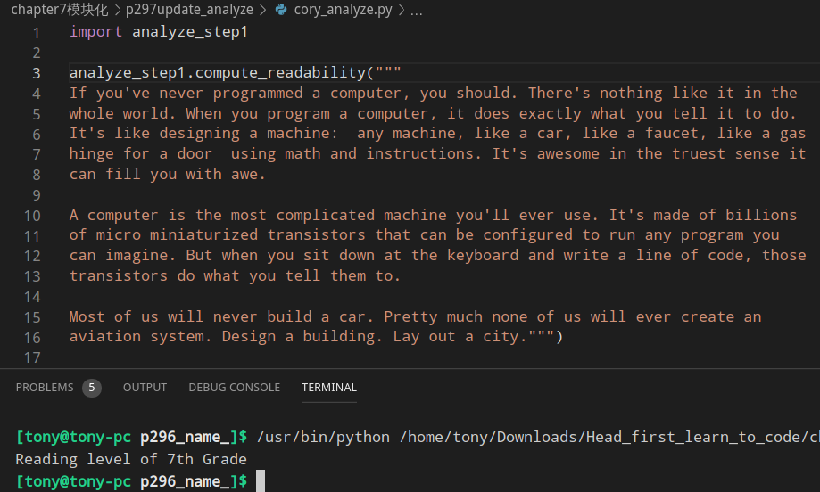
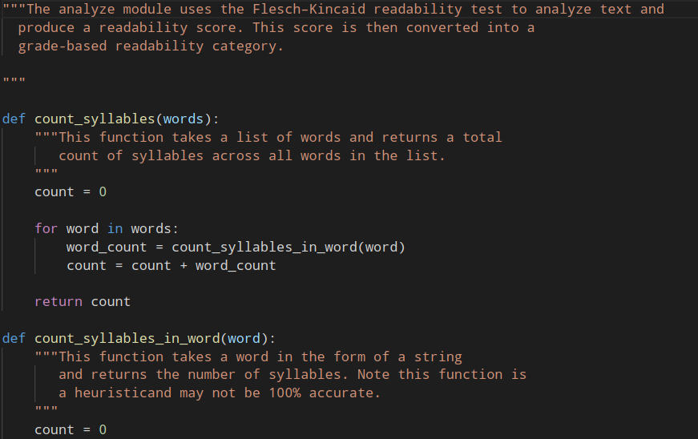
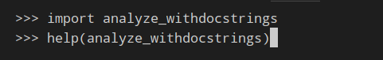
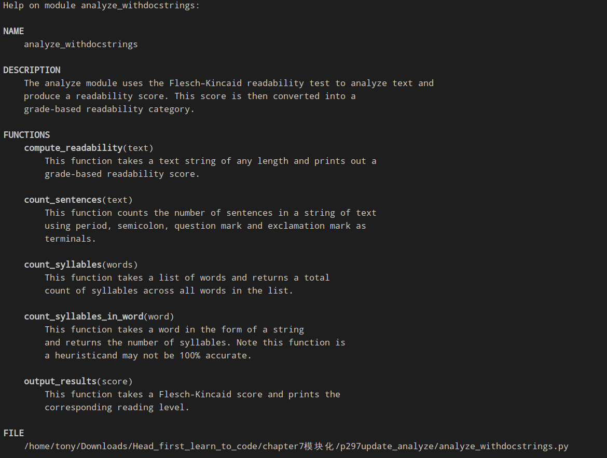

### 更新analy.py成为analyze_step1.py
需要把chapter6中的 analyze.py 拷贝过来在结尾加上
```python
# analyze_step1.py
if __name__ == "__main__":
    import ch1text
    print('Chapter1 Text:')
    compute_readability(ch1text.text)
```

这跟我们预想的结果一样,snslyze.py作为主程序,测试 ch1text.py 中的文本

### 将analyze_step1.py作为一个模块
```python
# cory_analyze.py
import analyze

# 调用analyze_step1.compute_readability
```


### 为 analyze_step1.py 增加 docstring
dostring的格式
> 1.只需在模块最上增加一个字符串作为一般描述
> 2.在每个函数定义后面增加一个字符串
> 3.对象定义后面也可以增加一个字符串
```python
# analyze_withdocstrings.py
```

使用help查看
```python
import analyze_withdocstrings

help(analyze_withdocstrings)
```

