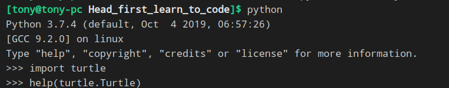
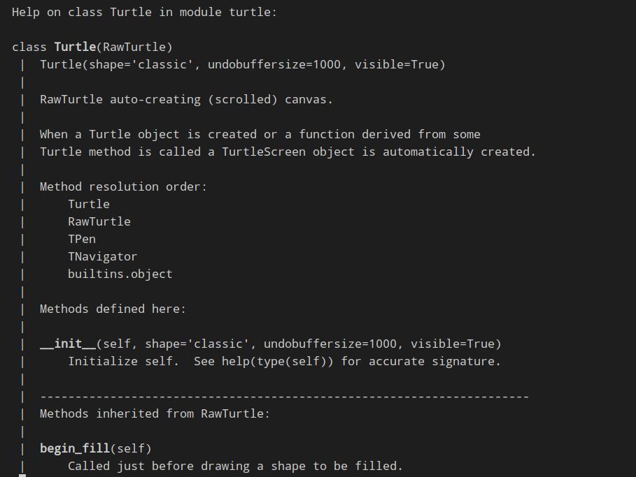
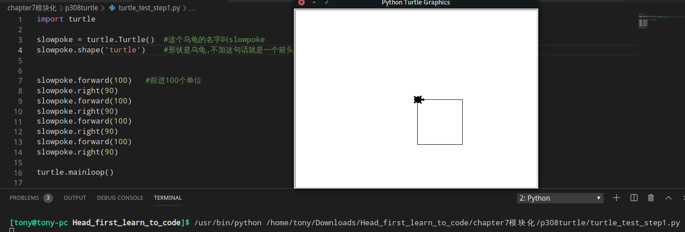
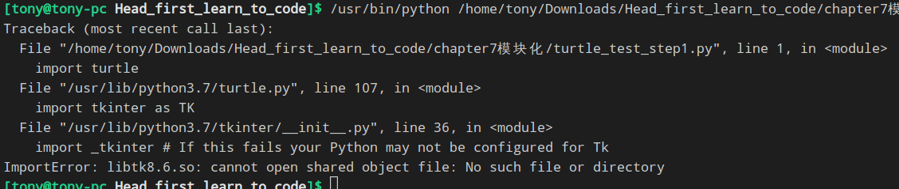
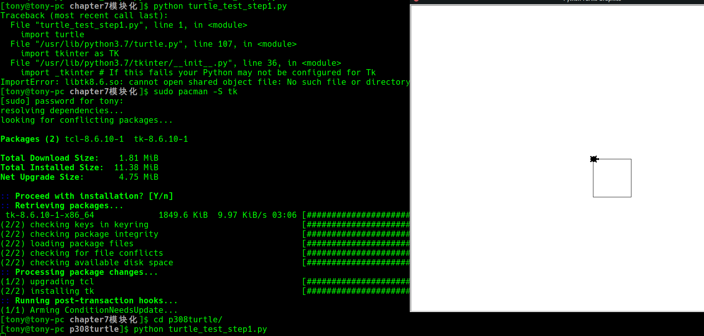
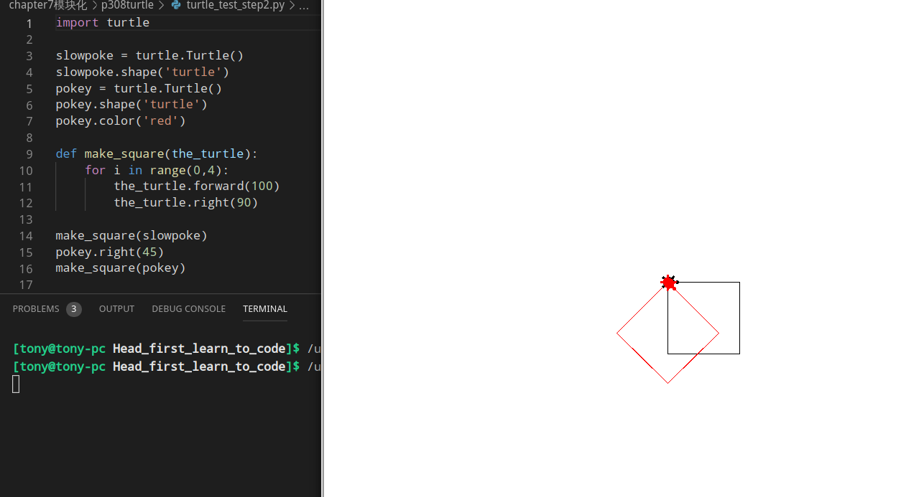
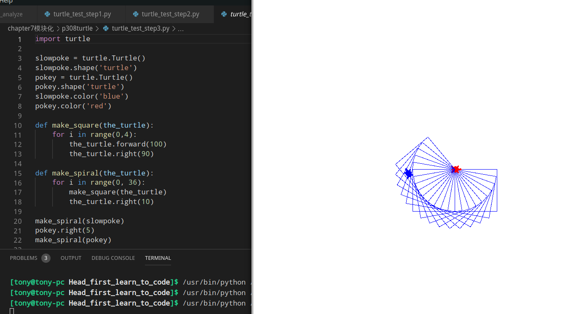
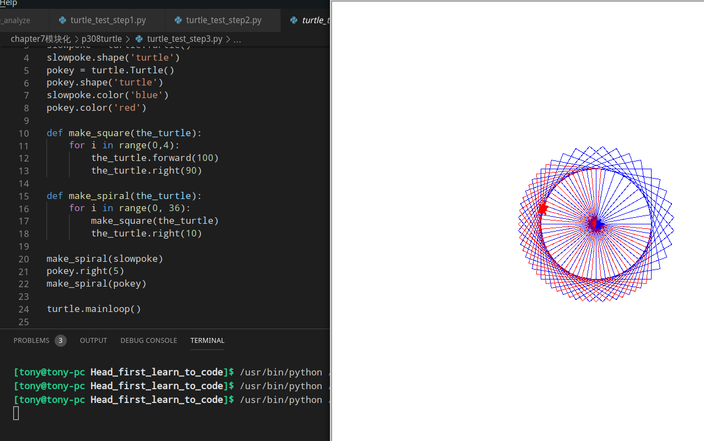
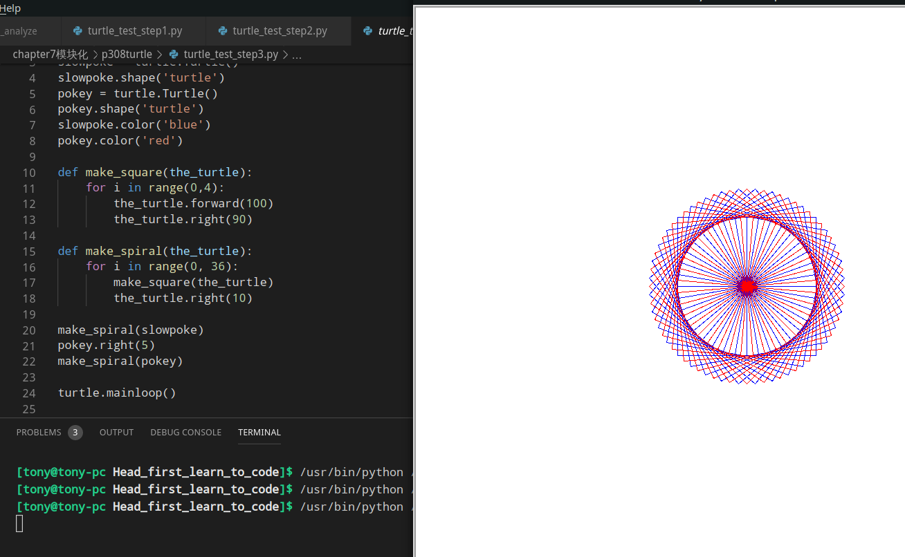
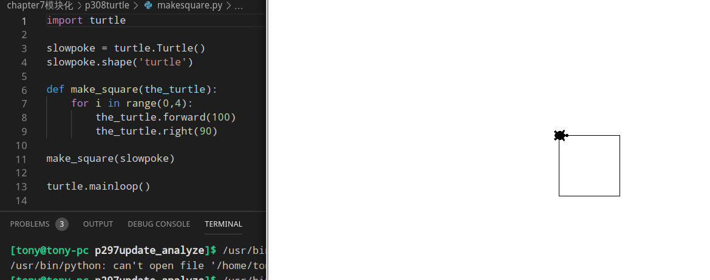

### 使用turtle.Turtle()方法



### Step1:创建自己的乌龟
当心不要命名为 ```turtle.py ``` 这样Python在查找模块会重名,就近一这个文件有限就看不到现象了,<br>正常运行,你将看到这样的结果<br>
这里的100表示100个单位,一般就是像素点
```python
turtle.mainloop()   #这行代码见识窗口所做的一切事务,包括点击关闭窗口的按钮,这行代码放在最后
```

##### Problem


##### Answer1:

All you need to do is to install the tkinter package. Now universal precompiled packages such as ActivePython will not work, well at least it didn't work for me. I don't know if this problem occurs in other OSes but I know the solution for Linux: Install the Tk package from the terminal.

In Arch, Tk is available in the Arch repository. You don't need aur for this, just type on the terminal:
```
sudo pacman -S tk
```
If you are on another Linux distro such as Debian or a Debian based distro you will probably have to find a PPA repository online and in Debian based distros just type on the terminal:
```
sudo apt-get install tk
```
Which applies to all distros.
##### Answer2:

I'm on Manjaro, use Gnome3 on Wayland. After installed 
```
tk
```
I got an error about Xorg. So I use Google, and found I need to install 
```
python-pygubu
```
from Visual editor for creating GUI in Python 3 tkinter.

And then another error like: ```Gtk-WARNING **: Unable to locate theme engine in module_path: "murrine". ```Also found a solution, to install 
```
gtk-engine-murrine
```
form that link.




### Step2 增加第二只乌龟


### Step3 繁花曲线




### 做一个矩形
