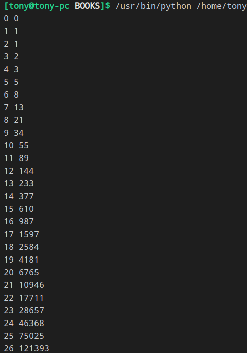
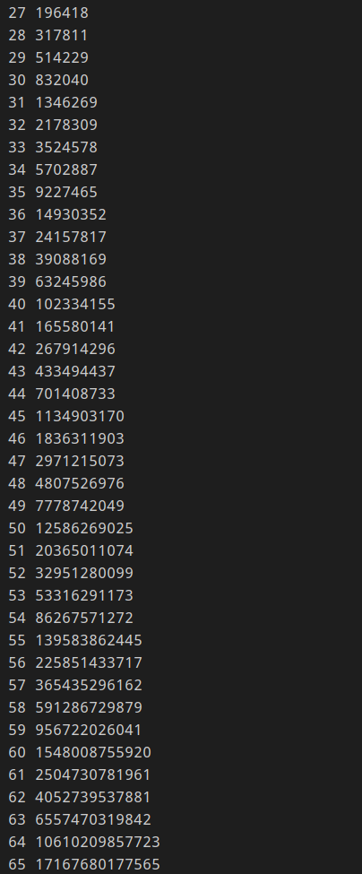
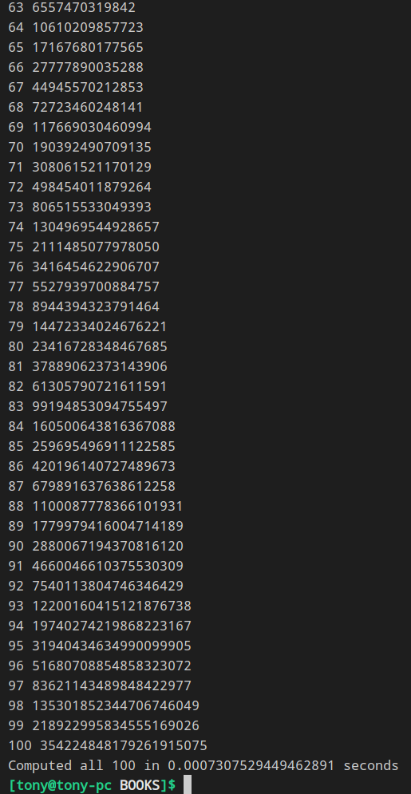

### 使用递归的缺点
[递归版斐波那契数列](../p357斐波那契数列/README.md): 
这个算法必须每次都要计算小于这个数的所有斐波那契数列的值,这样会造成大量的不必要的计算
### 升级版
我们想可不可以记住函数调用的结果-->采用字典记住我们的Fibonacci结果
#### 记忆化
<b>记忆化</b>是算法优化的一种策略,通过存储中间值的方式来减少运算带来的开销

这样居然不到一秒就做完了