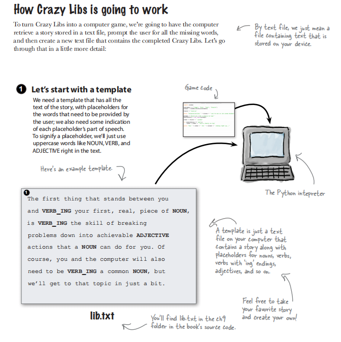
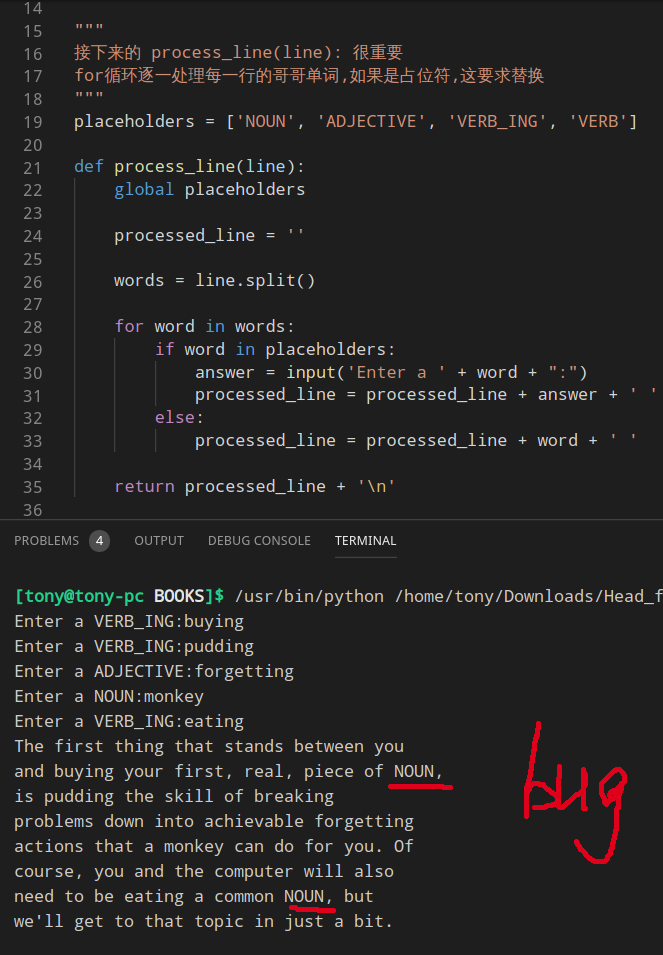
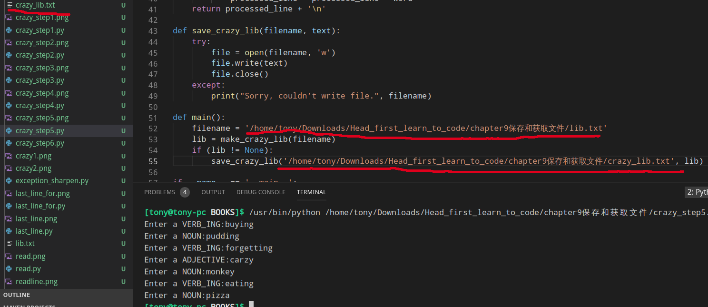

### 存储

### 实现一个Crazy Libs的思路



#### Step1从文件中读取故事文本
1.在python中读入一个文件,首先必须打开
```python
my_file = open('lib.txt', 'r')  #也可以是 'w' 写文件
```
2.工作完还不要忘记关闭
```python
my_file.close()
```
3.什么是将文件读入?
就是利用Python,可以得到文件的内容,并放到一个Python字符串里面,接下来就是使用Python字符串操作来处理文本信息

##### problem
但是python的问题,不知道为什么文件必须要写绝对路径

原因是VScode必须切换下面的目录


##### 其实也可以使用 read() 函数来进行读取文件

##### 可以使用 readline() 来读取其中一行

##### 怎么知道是最后一行
方法1:


方法2:可以使用python的带 in 的 for 循环
> 使用带in的 for 语句时,不论处理列表,字符串,文件还是字典,我们都在使用一个叫<b>迭代器</b>的组件
> 你不用操心迭代器是怎么实现的,只要知道迭代器会逐一处理数据,知道结束为止


#### Step2 处理模板文件,替换指定的单词


#### Step3 使用 strip() 从当前的字符串删除开头结尾的所有字符串


#### Step4 异常处理
错误一般分为
> 语法错误
> 语义错误
> 运行时错误

异常是执行代码期间发生的一个事件,Python解释器会停止执行代码,但是你也可以告诉解释器你来接管异常,需要吧可能出现的异常放在```try ... except ... finally```中
```python
#显式处理异常
try:
    filename = 'notthere.txt'
    file = open(filename, 'r')
except FileNotFoundError:
    print('Sorry,', filename, 'cound not be found.')
except IsADirectoryError:
    print("That's a directiory not a file!")
else:
    print("It's a good thing we could open that file.")
    file.close()
finally:
    print("I'm running no matter what happens")
```


#### Step5 输出到文件


#### Step6 可以针对不同模板
```python
import sys  #sys模块有一个属性是argv,其中包含命令行参数

def main():
    if len(sys.argv) != 2:
        print("crazy.py <filename>")
    else:
        filename = sys.argv[1]
        lib = make_crazy_lib(filename)
        if (lib != None):
            save_crazy_lib('crazy_' + filename, lib)
```
